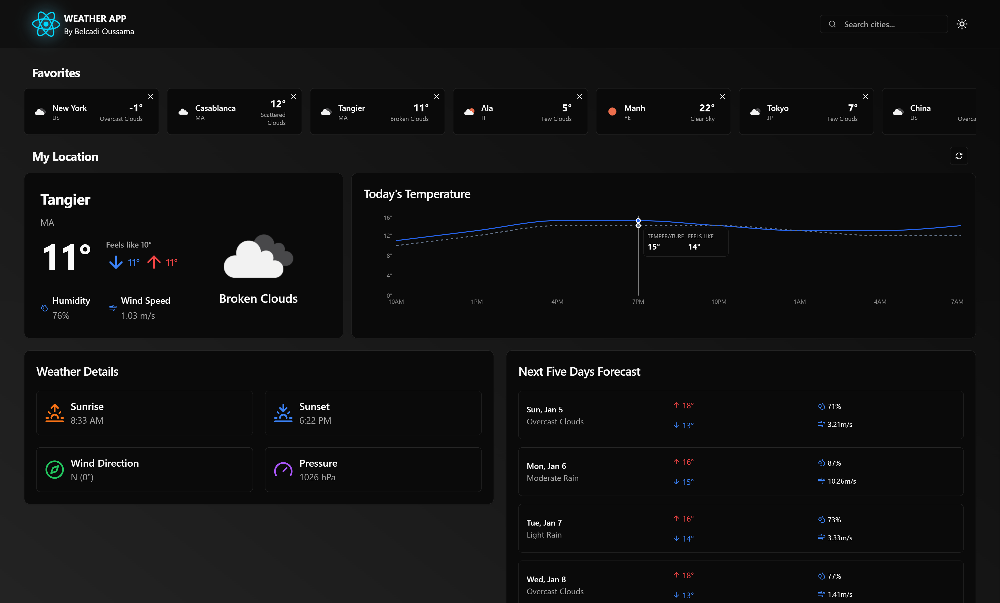

# Modern Weather APP In REACT & TypeScript 

## Overview  
This project is a modern weather application built using React.js and TypeScript, powered by the OpenWeather API. It provides real-time weather updates, allows you to search for global cities, and displays detailed 24-hour forecasts. Designed with a focus on performance and user experience, the app features a clean UI and seamless responsiveness across all devices.  

## Features  
- 🌍 **Real-Time Weather**: Displays current weather data for your location using the OpenWeather API.  
- 🔍 **City Search**: Search for and view weather information for cities worldwide.  
- ⏱️ **24-Hour Forecast**: Provides detailed hourly weather forecasts.  
- 🌑 **Dark Mode**: Offers a light/dark mode toggle for an enhanced user experience.  
- 💾 **Favorites**: Save your favorite cities for quick access to their weather data.  
- 📱 **Responsive Design**: Optimized for desktops, tablets, and mobile devices.  

## Tech Stack  
- **React.js**: A powerful library for building dynamic user interfaces.  
- **TypeScript**: Adds type safety to enhance maintainability and reduce runtime errors.  
- **TanStack Query**: Simplifies state management, data fetching, and caching.  
- **Shad CN UI**: Provides modular and elegant UI components for a polished design.  
- **OpenWeather API**: Supplies accurate weather data and forecasts for the app.

<!-- Main Dashboard Image -->
## APP Dashboard

<!-- City Search and City Page Screenshots -->
## City Search and Favorites

### City Search Functionality

### City Page and Add to Favorites Functionality

<!-- Responsive Design Across Devices -->
## Responsive Design Across Devices

### Desktop Version (Light)
  

### Desktop Version (Dark)
  

### Tablet Version (Light)
  

### Tablet Version (Dark)  
  

### Phone Version (Light)
  

### Phone Version (Dark)  
  
